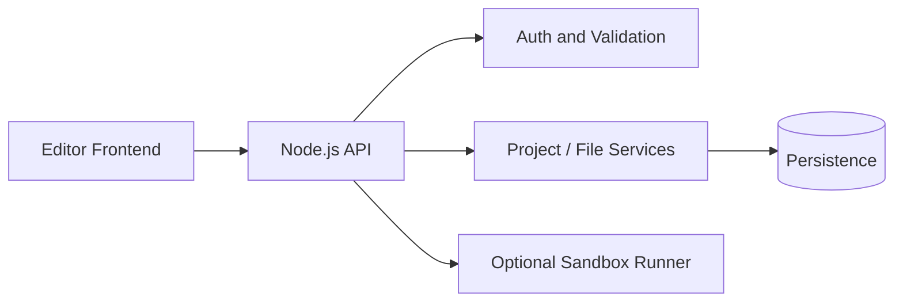

<div align="center">

# 🧑‍💻 Code Editor Backend

**The API and execution layer for a browser-based code editor.**

[](https://developer.mozilla.org/) [](https://nodejs.org/) [](#api)

</div>

## ✨ Overview

This service supports editor projects, files, sessions, and the backend workflows needed by the companion frontend.

## 🧱 Architecture



## 🖼️ Screenshots

Backend project: add API documentation or request/response images to `docs/screenshots/`.


## ⚡ Run locally

```bash
npm install
cp .env.example .env
npm run dev
```

## 🔌 API

Use the route definitions in the source as the source of truth for project, file, authentication, and execution endpoints.

## 🔒 Security

Never execute untrusted code directly in the API process. Use authentication, resource limits, isolated workers, and strict validation before production deployment.

## 📄 License

MIT License.
